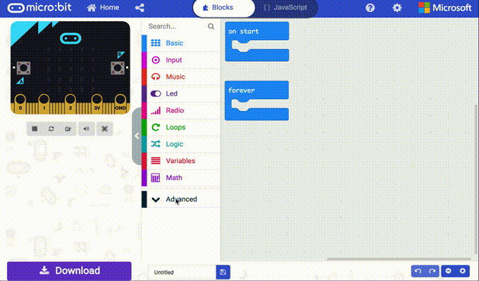
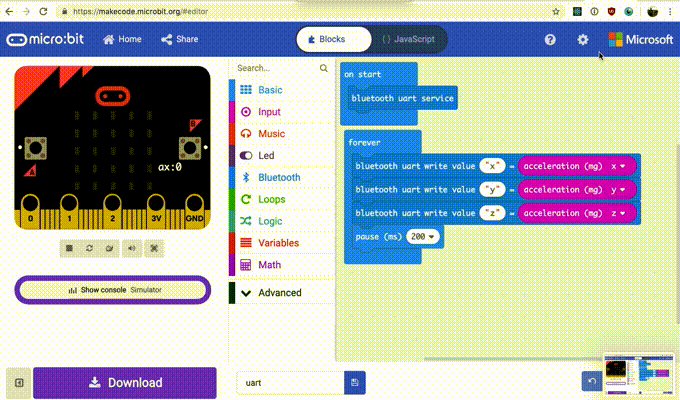

# Product Design: Electronic Things Git Repository

Code to support the Product Design Electronic Things course using the Arduino and BBC micro:bit

# Contents

<!-- TOC depthFrom:1 depthTo:6 withLinks:1 updateOnSave:1 orderedList:0 -->

- [Product Design: Electronic Things Git Repository](#product-design-electronic-things-git-repository)
- [Contents](#contents)
- [micro:bit](#microbit)
	- [Languages](#languages)
		- [Blocks](#blocks)
			- [Blocks JavaScript](#blocks-javascript)
			- [Filesystem](#filesystem)
			- [BLE](#ble)
		- [Python](#python)
		- [Arduino](#arduino)
	- [BLE](#ble)
		- [MakeCode Setup](#makecode-setup)
		- [Tools](#tools)
			- [Mobile](#mobile)
			- [Desktop](#desktop)
	- [Code](#code)
		- [microbit-arduino](#microbit-arduino)
			- [simple-ble-uart](#simple-ble-uart)
			- [ble-accelerometer](#ble-accelerometer)
			- [libraries](#libraries)
				- [MMA8653](#mma8653)
				- [SparkFun_MAG3110](#sparkfunmag3110)
	- [Arduino IDE](#arduino-ide)
		- [Set Style](#set-style)
	- [Troubleshooting](#troubleshooting)

<!-- /TOC -->

---

# micro:bit

## Languages

There are a number of ways you can interact with the micro:bit depending what you are comfortable with.

### MakeCode Blocks

MakeCode Block is a [Scratch-like](https://scratch.mit.edu) environment for coding with the micro:bit.

You can write blocks code on the [make code website](https://makecode.microbit.org/)


Blocks is a simplification of programming with the micro:bit and a great place to start if you are new to programming. Some operations that would usually be complex have already been encapsulated into function blocks, making things like radio and bluetooth communication much easier.

#### MakeCode Blocks JavaScript

MakeCode Blocks are essentially just javascript code, if you press the Javascript switch you can start editing the code directly


#### Filesystem

[Use blocks to access filesystem](https://support.microbit.org/support/solutions/articles/19000067844-how-do-i-access-files-on-the-micro-bit-in-the-makecode-editor-)

#### BLE

To stream data over bluetooth via make code, do the following using Google Chrome

- create a project
- Click settings cog
  - project settings set "No Pairing Required: Anyone can connect via Bluetooth."
- start the ble uart service and write data over uart

```js
bluetooth.startUartService();
basic.forever(function() {
  bluetooth.uartWriteValue("x", input.acceleration(Dimension.X));
  bluetooth.uartWriteValue("y", input.acceleration(Dimension.Y));
  bluetooth.uartWriteValue("z", input.acceleration(Dimension.Z));
  basic.pause(200);
});
```

- Click settings cog
  - click about
  - select Experiments
  - activate bluetooth
  - go back

* Click settings cog
  - pair bluetooth

You should now see a show device console and you can export data from the session.

---

### Python

Write python code for the micro:bit [in the browser](https://python.microbit.org/v/1.1) or [download the Mu editor](http://codewith.mu).

Python makes operations like parsing large amounts of data and writing data to files quite trivial. If your project involves saving a lot of data, think about writing in python


### Arduino

You can write for the micro:bit from the Arduino IDE. If you already know C++ or would like to learn more about using the Arduino platform, this may be a good place to start.

[There is a fairly comprehensive guide to setting up the micro:bit for use with the Arduino IDE at Adafruit's Website](https://learn.adafruit.com/use-micro-bit-with-arduino/overview). This is still being developed so some functions may not be available with the Arduino IDE that are available with other programming languages.

---

## BLE

The microbit is capable of broadcasting bluetooth low energy data. The following tools will come in handy if you wish to monitor information over bluetooth

### MakeCode Setup

To setup bluetooth in make code, you must first add the bluetooth. In the blocks menu, select extensions and add bluetooth.



Logging data via bluetooth is currently still experimental. You will need to select `About` then experiments and choose bluetooth console.



At the moment, the console only seems to like data in the format of a `key` / `value` pair. So, use the `bluetooth.uartWriteValue` block for now.

### Tools

#### Mobile

- [LightBlue](https://punchthrough.com)
  - [iOS](https://itunes.apple.com/us/app/lightblue-explorer-bluetooth/id557428110?mt=8)
  - [Android](https://play.google.com/store/apps/details?id=com.punchthrough.lightblueexplorer&pcampaignid=MKT-Other-global-all-co-prtnr-py-PartBadge-Mar2515-1)
- [Adafruit Bluefruit Connect SE](https://learn.adafruit.com/bluefruit-le-connect-for-ios)
- [nRF Connect](https://www.nordicsemi.com/Software-and-Tools/Development-Tools/nRF-Connect-for-mobile)

#### Desktop

- [Adafruit Bluefruit Connect SE](https://github.com/adafruit/adafruit-bluefruit-le-desktop)
- [nRF Connect](https://www.nordicsemi.com/Software-and-Tools/Development-Tools/nRF-Connect-for-desktop)
- [btlejack [python interface]](https://github.com/virtualabs/btlejack)

---

## Code

### microbit-arduino

These examples relate to programming the microbit with the Arduino IDE. make sure to follow the [setup instructions at Adafruit](https://learn.adafruit.com/use-micro-bit-with-arduino/install-board-and-blink)

#### simple-ble-uart

Simple demonstration of sending data over BLE.

#### ble-accelerometer

Broadcast accelerometer data over a BLE UART service. Remember to install the correct [libraries](#libraries). You should also install a [BLE tool](#tools).

#### libraries

Drag and drop the contents of the libraries folder into your `Arduino/libraries` otherwise some examples will not compile.

##### Combined Accelerometer / Magnetometer (LSM303AGR)

For the new version microb:bit there is a Combined Accelerometer / Magnetometer. Use the [LSM303AGR](https://github.com/stm32duino/LSM303AGR) library.

---

## Arduino IDE

### Accelerometer and Magnetometer

For using the accelerometer and using the magnetometer, first [Check Your Board Version](https://learn.adafruit.com/use-micro-bit-with-arduino/accelerometer-and-magnetometer)

It should be the [Combined Accelerometer / Magnetometer (LSM303AGR)](https://github.com/stm32duino/LSM303AGR)

### Set Style

Select syntax highlighting in the following file

```bash
/Applications/Arduino.app/Contents/Resources/Java/lib/theme/theme.txt
```

---

## Troubleshooting

Sometimes everything can just stop working. If that is the case, a good first step is to perform a [factory reset](https://support.microbit.org/support/solutions/articles/19000021613-reset-the-micro-bit-to-factory-defaults).

From there, try and build your program back up gradually to identify where something went wrong.
